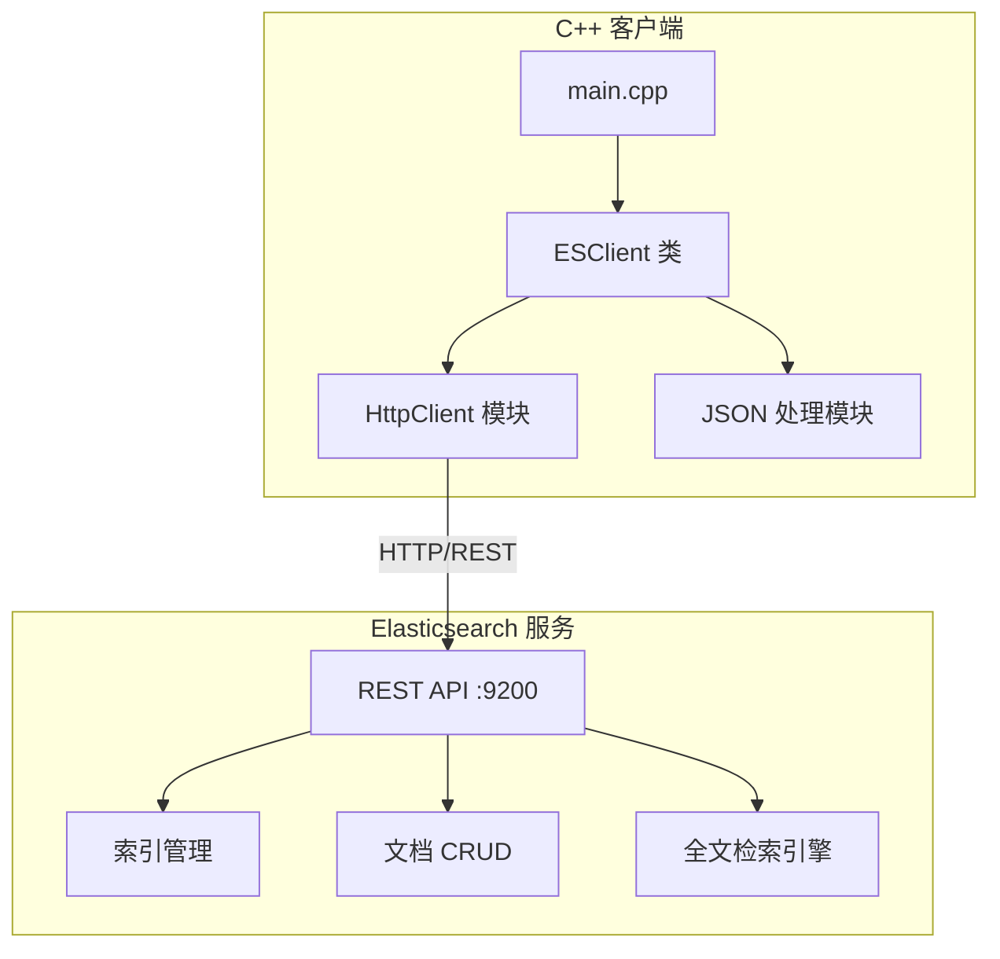
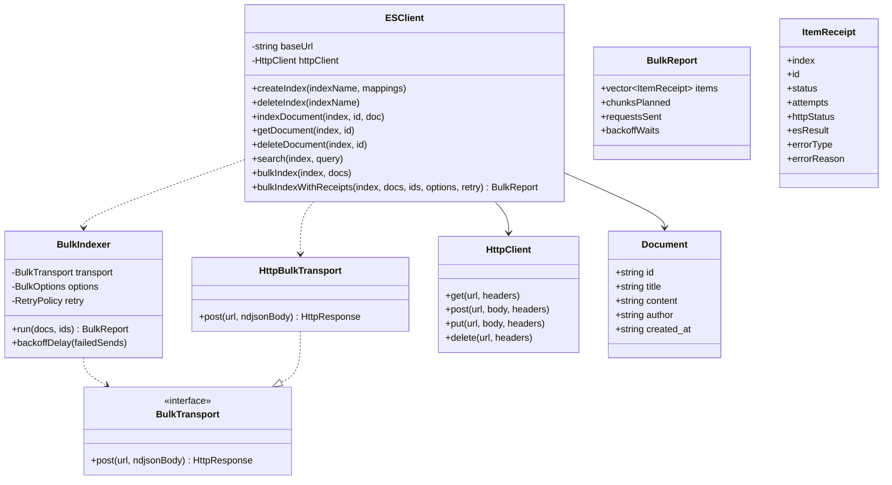

# Elasticsearch 全文检索 C++ 示例项目设计

## 1. 系统架构



## 2. 模块设计



## 3. 功能清单

| 功能模块 | 功能点     | 说明                           |
| -------- | ---------- | ------------------------------ |
| 索引管理 | 创建索引   | 支持自定义 mapping 和 settings |
| 索引管理 | 删除索引   | 删除指定索引                   |
| 索引管理 | 查看索引   | 获取索引信息                   |
| 文档操作 | 添加文档   | 单条/批量添加                  |
| 文档操作 | 可靠批量导入 | 可控分块、逐项回执（保持原序）、429/502/503/504 与短暂传输失败的有上限退避重试、永久错误立即失败、断连同批重放幂等 |
| 文档操作 | 获取文档   | 根据 ID 获取                   |
| 文档操作 | 更新文档   | 更新指定文档                   |
| 文档操作 | 删除文档   | 删除指定文档                   |
| 全文检索 | Match 查询 | 分词匹配查询                   |
| 全文检索 | Term 查询  | 精确匹配查询                   |
| 全文检索 | Bool 查询  | 组合条件查询                   |
| 全文检索 | 高亮显示   | 搜索结果高亮                   |
| 全文检索 | 分页查询   | 支持 from/size                 |

## 4. API 接口设计

### 4.1 索引管理

- `PUT /{index}` - 创建索引
- `DELETE /{index}` - 删除索引
- `GET /{index}` - 获取索引信息

### 4.2 文档操作

- `POST /{index}/_doc/{id}` - 添加/更新文档
- `GET /{index}/_doc/{id}` - 获取文档
- `DELETE /{index}/_doc/{id}` - 删除文档
- `POST /{index}/_bulk` - 批量操作

### 4.3 搜索接口

- `POST /{index}/_search` - 搜索文档

## 5. 技术选型

| 组件        | 技术          | 版本  |
| ----------- | ------------- | ----- |
| 编程语言    | C++           | 17    |
| HTTP 客户端 | libcurl       | 7.x   |
| JSON 库     | nlohmann/json | 3.x   |
| 搜索引擎    | Elasticsearch | 8.x   |
| 构建工具    | CMake         | 3.16+ |
| 容器化      | Docker        | 20.x  |

## 6. 目录结构

```
es-cpp-demo/
├── backend/
│   ├── CMakeLists.txt
│   ├── Dockerfile
│   ├── include/
│   │   ├── es_client.hpp
│   │   ├── bulk_indexer.hpp
│   │   ├── http_client.hpp
│   │   └── nlohmann/
│   ├── src/
│   │   ├── main.cpp
│   │   ├── es_client.cpp
│   │   ├── bulk_indexer.cpp
│   │   ├── bulk_transport_http.cpp
│   │   └── http_client.cpp
│   ├── demo/bulk_receipt_demo.cpp
│   ├── tests/test_bulk_indexer.cpp
│   ├── testutil/fake_es.hpp
│   └── data/
│       └── sample_data.json
├── docker-compose.yml
├── .gitignore
├── README.md
└── docs/
    └── project_design.md
```

## 7. 可靠批量导入的关键决策

- **稳定业务 ID 是幂等前提**：动作行固定 `{"index":{"_index":...,"_id":业务ID}}`，
  因此响应前断连后重放同一分块只会覆盖同 `_id` 文档，不产生重复；无 ID /
  ID 数量不匹配 / ID 重复在发送前拒绝。
- **重试白名单**：仅 429、502、503、504 与响应到达前的传输故障可重试；
  400（mapping 校验等）立即永久失败，避免无意义放大流量。
- **只重试未确认项**：整批限流重发整块；200 内个别条目失败时，后续请求
  只携带这些 `_id`。
- **退避可替换**：`RetryPolicy` 暴露 `sleep(ms)` 与 `jitter()` 两个注入点，
  默认实现为 `sleep_for` + `mt19937`，测试注入零延迟与固定抖动。
- **传输抽象**：核心逻辑只依赖 `BulkTransport` 接口，libcurl 适配与
  脚本化内存版 ES 可互换，离线即可证明全部重试边界。
